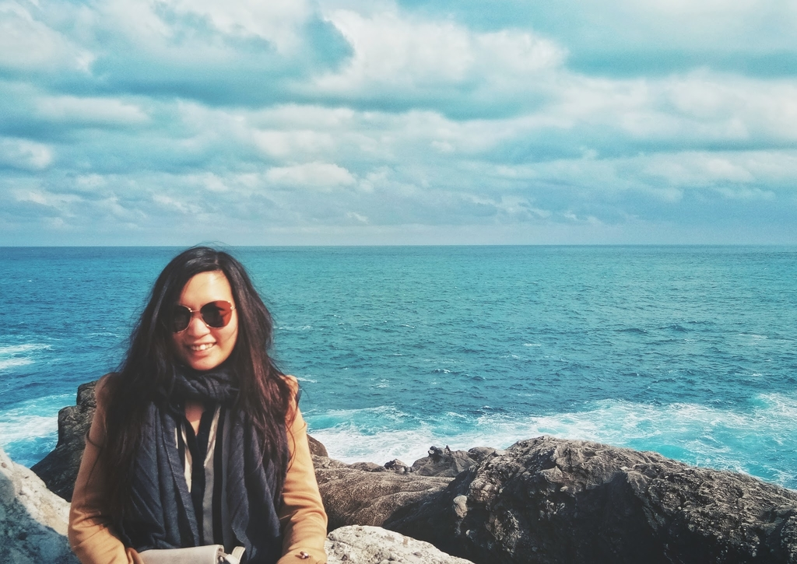

Thank you for visiting my page! Here is Shi Yi speaking, I am a polyglot originally from Malaysia and have been living in Europe since 2013.

Being a holder of both [LLB Law](https://www.bristol.ac.uk/study/undergraduate/2022/law/llb-law/) and [M.A. Intercultural Communication & European Studies](https://www.hs-fulda.de/en/studies/departments/social-and-cultural-sciences/future-students/study-programmes/intercultural-communication-and-european-studies-ma), I am aspired to promote the cooperation instead of hierarchy between soft and hard sciences.

Over the years, I have established solid expertise especially in the following areas - scroll down to check out my portfolios!
- **linguistic services:** translation, writing, transcription, proofreading, copyediting
- **administrative skills:** communication, organisation, account/file management, database maintenance, project/event coordination, intercultural competence
- **IT know-how:** Windows/Microsoft Office, macOS/iWork, Google Suite, Git/Github, CAT tools e.g. Transcafe/Smartcat, Wordpress, Blogspot

(If you decide to ask me) one really can't go wrong with...
- **Literature by:** George Orwell, Michel Foucault, Friedrich Nietzsche, Lu Xun/ 鲁迅
- **Music by:** MONO, Ryuichi Sakamoto, Sigur Rós, World's End Girlfriend, ABBA, The Beatles
- **Films like:** V for Vendetta, The Matrix, Memento, Pulp Fiction, Farewell My Concubine/ 霸王别姬
- **Series like:** The Office (US), Bojack Horseman, Twin Peaks
